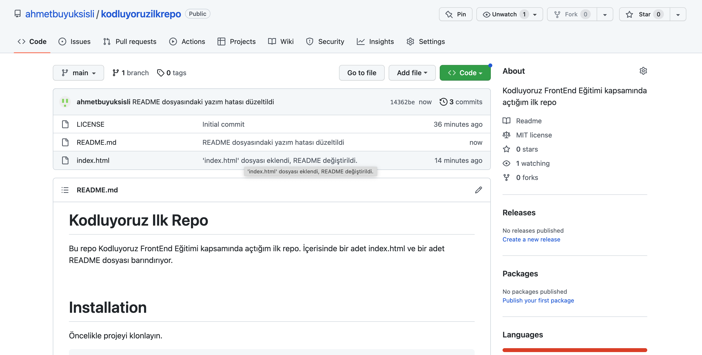

# Kodluyoruz Ilk Repo
Bu repo Kodluyoruz FrontEnd Eğitimi kapsamında açtığım ilk repo. İçerisinde bir adet index.html ve bir adet README dosyası barındırıyor.



# Installation
Öncelikle projeyi klonlayın.

```
https://github.com/ahmetbuyuksisli/kodluyoruzilkrepo.git
```

# Usage
Projeyi klonladıktan sonra Visual Studio Code programında açınız.

Linux için: 

```
cd kodluyoruzilkrepo
code .
```
# Contributing
Pull requestler kabul edilir. Büyük değişiklikler için, lütfen önce neyi değiştirmek istediğinizi tartışmak için bir konu açınız.

# Licence
[MIT](https://choosealicense.com/licenses/mit/)